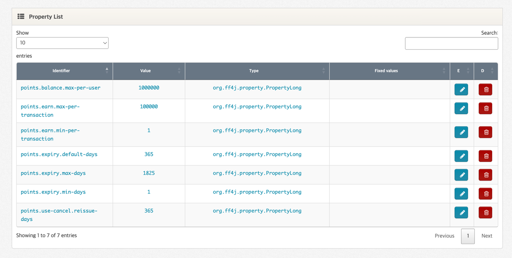
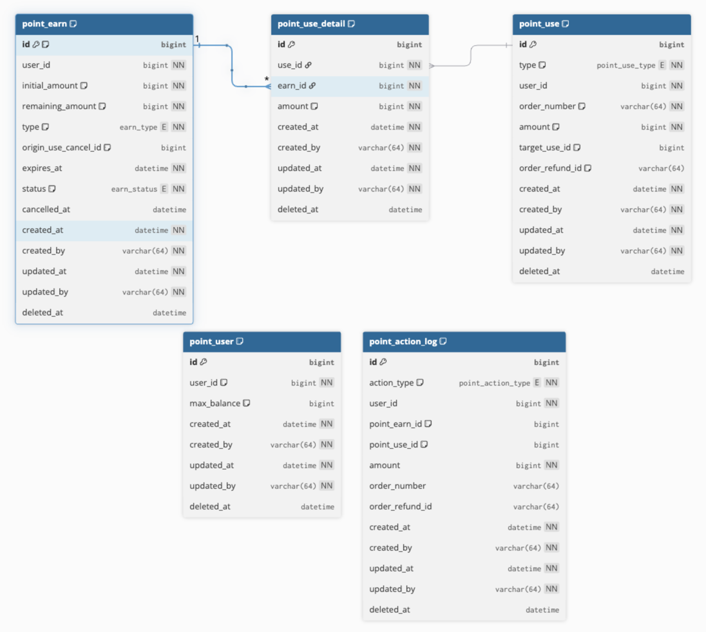

# 무료 포인트 시스템 (points-subject)

회원별 **무료 포인트의 적립 / 적립취소 / 사용 / 사용취소** 4가지 상태 변경과 **잔액·이력 조회**를 처리하는 Spring Boot REST API 입니다.

---

## 목차

1. [프로젝트 개요](#1-프로젝트-개요)
2. [과제 설명](#2-과제-설명)
3. [빌드 및 실행 방법](#3-빌드-및-실행-방법)
4. [FF4J 사용 이유](#4-ff4j-사용-이유)
5. [테이블 ERD](#5-테이블-erd)
6. [금액 흐름 추적 — 사용 / 사용취소](#6-금액-흐름-추적--사용--사용취소)
7. [API 명세](#7-api-명세)

## 관련 문서

본 README 는 프로젝트의 의도와 핵심 설계를 담고, 아래 두 문서가 디테일을 분담합니다.

| 문서 | 다루는 내용                                                                                                            |
| --- |-------------------------------------------------------------------------------------------------------------------|
| [`docs/API.md`](docs/API.md) | 8개 REST 엔드포인트 풀스펙 — Request/Response 스키마, 검증 규칙, curl 예시, 에러 코드 매핑, admin 엔드포인트 분리 의도                             |
| [`docs/AWS.md`](docs/AWS.md) | AWS 위에서 운영 시의 아키텍쳐 토폴로지(Application Server/MySQL/Redis/Kafka), sync vs async 흐름 분리, 다이어그램. |

---

## 1. 프로젝트 개요

### 1.1 시스템이 하는 일

- 회원별 **무료 포인트 적립** (시스템 자동 / 운영자 수기)
- 적립 단위 **취소** (사용된 적립은 취소 불가)
- 주문 단위 포인트 **사용** (`orderNumber` 멱등 키)
- **부분 / 전체 사용취소** + 만료된 적립의 자동 **재발급**
- 회원 **잔액** 조회 + 거래 **이력** 통합 조회 (EARN / EARN_CANCEL / USE / USE_CANCEL)

### 1.2 기술 스택

| 분류 | 선택 | 비고 |
| --- | --- | --- |
| Language | Java 21 |  |
| Framework | Spring Boot 3.5.14 | 3.x 마지막 minor (LTS 2032-06-30) |
| Persistence | Spring Data JPA + H2 (in-memory, MySQL mode) | 단일 인스턴스 전제 |
| Validation | Bean Validation (Jakarta) | |
| 정책 외부화 | **FF4j 2.1** (JDBC store + Web Console) | 무중단 정책 변경 |
| Audit | Hibernate Envers (`PointEarn` 한정) | mutable 컬럼 revision 보존 |
| Build | Gradle (Groovy DSL) | wrapper 커밋 |
| Test | JUnit 5 | |

---

## 2. 과제 설명

회원에게 지급하는 **무료 포인트** 의 라이프사이클 전체를 관리합니다.

### 2.1 4가지 행위

| 행위 | 설명 | 핵심 규칙 |
| --- | --- | --- |
| **적립 (Earn)** | 회원에게 포인트를 발급 | 1회 1~100,000 포인트, 만료일 1일~5년 (외부화), 1원 단위 추적, SYSTEM/MANUAL 식별 |
| **적립취소 (Earn Cancel)** | 적립 단위 취소 | **사용된 적립은 취소 불가** |
| **사용 (Use)** | 주문 결제에 포인트 차감 | `orderNumber` 필수 (멱등), 우선순위: **수기 → 만료 임박 → 적립일 빠른 순** |
| **사용취소 (Use Cancel)** | 결제 환불 시 포인트 복원 | **전체/부분** 가능, 만료된 원본은 신규 적립으로 **재발급**, `orderRefundId` 멱등 |

### 2.2 조회

- **잔액**: ACTIVE 상태 + 미만료 적립의 `remaining_amount` 합계
- **이력**: 4가지 행위 통합 시계열 (발생 시각 내림차순)

### 2.3 비기능 요구

- **1회 적립 한도**, **회원별 보유 한도**는 **하드코딩 금지** → 운영 중 변경 가능해야 함
- **회원별 보유 한도 개별 설정** 가능 (글로벌 default 위에 회원별 값 덮어쓰기)
- **포인트 사용 우선순위** 보장
- **1원 단위 추적**: 어느 적립건이 어디에 얼마 차감됐는지 재구성 가능해야 함

---

## 3. 빌드 및 실행 방법

### 3.1 사전 조건

- **JDK 21** 이 `JAVA_HOME` 에 설정되어 있어야 합니다.
- 별도 DB 설치 불필요 — H2 in-memory 로 자동 기동합니다.

### 3.2 명령어

```bash
./gradlew bootRun                     # 애플리케이션 실행 (포트 8080)
./gradlew build                       # 전체 빌드 + 테스트
./gradlew test                        # 테스트만 실행
./gradlew test --tests "*UseTest"     # 특정 테스트
./gradlew clean
```

### 3.3 기동 후 접근 경로

| 경로                                      | 용도 | 접속 정보 |
|-----------------------------------------| --- | --- |
| `http://localhost:8080/h2-console`      | H2 웹 콘솔 — DB 직접 조회 | JDBC URL: `jdbc:h2:mem:points` / User: `sa` / Password: *(공란)* |
| `http://localhost:8080/ff4j-console/properties`   | FF4j Web Console — 정책 키(7종) 를 런타임에 즉시 변경 | 인증 없음 (본 과제 범위) |
| `http://localhost:8080/actuator/health` | Spring Actuator health probe | — |

### 3.4 주요 API

| Method | Path | 용도 |
| --- | --- | --- |
| POST | `/api/points/earn` | 시스템 적립 |
| POST | `/api/points/earn/{earnId}/cancel` | 적립 취소 |
| POST | `/api/points/use` | 포인트 사용 |
| POST | `/api/points/cancel` | 사용 취소 (전체/부분) |
| GET | `/api/points/users/{userId}/balance` | 잔액 조회 |
| GET | `/api/points/users/{userId}/history` | 거래 이력 |
| POST | `/api/admin/points/earn` | 운영자 수기 적립 (`type=MANUAL`) |
| PUT | `/api/admin/users/{userId}/max-balance` | 회원별 한도 개별 설정 |

---

## 4. FF4J 사용 이유

### 4.1 핵심 이유 — 운영 중 무중단 정책 변경

요구사항의 "**1회 적립 한도와 회원별 보유 한도를 하드코딩이 아닌 방법으로 제어**" 의 본질을 **운영 중 무중단 변경**으로 해석했습니다. 단순히 yml 분리만으로는 정책을 바꾸려면 재배포가 필요해 그 요구를 충족하지 못합니다.

### 4.2 대안 비교

| 대안 | 채택하지 않은 이유 |
| --- | --- |
| `application.yml` + `@ConfigurationProperties` | 변경 시 **재배포 필요** → 무중단 변경 불가 |
| 정책 테이블 + Admin API 직접 구현 | Web Console / Audit / REST 를 모두 직접 구축해야 함 |
| Spring Cloud Config / Consul KV | 분산 환경용. 단일 인스턴스 + H2 환경에서 오버스펙 |
| **FF4j 2.1** | ✅ Web Console + JDBC Property Store 기본 제공 |

### 4.3 운영 모델

```
[부팅 시]   PointPolicyBootstrapper  →  yml 시드 값을 FF4J_PROPERTIES 에 INSERT (미존재 키만)
[런타임]    PointPolicyService(facade)  →  ff4j.getProperty(key) 만 호출
[변경]      Web Console / REST  →  즉시 반영 (FF4J_PROPERTIES UPDATE + 캐시 무효화)
```

도메인 코드는 `PointPolicyService` facade 만 의존하므로 정책 저장소 구현이 facade 뒤에 격리됩니다.

운영자는 다음과 같이 Web Console 에서 정책 값을 즉시 변경할 수 있습니다.



> **변경 이력 (Audit) 영속화 — 본 과제 미적용**
> FF4j 의 변경 이벤트는 기본 `InMemoryEventRepository` 로 라우팅되어 메모리에만 남고 재기동 시 휘발됩니다. (`JdbcEventRepository` 빈을 등록하면 `FF4J_AUDIT` 테이블에 영속화 가능하지만 본 코드엔 미적용.)

### 4.4 관리 키 7종

| 키 | 의미 | 시드 |
| --- | --- | --- |
| `points.earn.min-per-transaction` | 1회 적립 하한 | 1 |
| `points.earn.max-per-transaction` | 1회 적립 한도 | 100,000 |
| `points.balance.max-per-user` | 회원별 보유 한도 (글로벌 default) | 1,000,000 |
| `points.expiry.default-days` | 만료일 기본값 | 365 |
| `points.expiry.min-days` | 만료일 하한 | 1 |
| `points.expiry.max-days` | 만료일 상한 (5년 미만) | 1825 |
| `points.use-cancel.reissue-days` | 사용취소 재발급 만료일 | 365 |

> **회원별 한도 개별 설정** 은 FF4j 가 아닌 `point_user.max_balance` 컬럼이 담당합니다.
> `effectiveLimit = COALESCE(point_user.max_balance, FF4j[points.balance.max-per-user])`

---

## 5. 테이블 ERD

### 5.1 한눈에 보기

요구사항은 4가지 행위(적립/적립취소/사용/사용취소)지만, **행위 = 테이블** 1:1 매핑 대신 각 요구사항이 실제로 만들어내는 데이터 모양에 맞춰 설계했습니다.



> **5개 테이블로 정리한 이유** (테이블별 상세는 §5.2)
> - **`point_earn`**: 적립취소를 같은 row 의 상태 변경으로 통합 → 별도 테이블 불필요.
> - **`point_use`**: 사용·사용취소를 sparse-column 으로 공존 + self-reference 로 부분취소 누적 SUM.
> - **`point_use_detail`**: "1원 단위 추적" 요구의 유일한 source of truth.
> - **`point_user`** (메타): 회원별 한도 + 비관적 락 row.
> - **`point_action_log`** (로그): 4행위 통합 이력 조회용 append-only projection.

### 5.2 테이블별 역할과 의도

#### `point_earn` — 적립 원장 [코어]
- **의도**: 적립 단위 1건 = 1 row. PK `id` 가 PRD 의 **"pointKey"** 를 그대로 담당. 적립취소(1:0..1)는 별도 테이블 없이 같은 row 의 `status` / `cancelled_at` 으로 통합 → 매 잔액 조회마다 join 회피. `remaining_amount` 등이 mutable 이라 **Hibernate Envers `@Audited` 적용** → `point_earn_aud` 에 풀 스냅샷 자동 기록.
- **핵심 컬럼**: `initial_amount`(immutable), `remaining_amount`(mutable), `type`(`SYSTEM`/`MANUAL`/`USE_CANCEL_REISSUE`), `expires_at`/`status`/`cancelled_at`, `origin_use_cancel_id`(sparse, 재발급 역추적).

#### `point_use` — 사용 + 사용취소 통합 [코어]
- **의도**: USE / USE_CANCEL 두 종류를 한 테이블에 공존시키는 **sparse-column inheritance**. 본질이 "주문 단위 거래 row" 로 같음 + USE_CANCEL 의 `target_use_id` 가 같은 테이블의 USE row 를 self-reference 해 **부분취소 누적액을 SUM 한 번**으로 도출 (`cancelled_amount` 캐시 컬럼 불필요).
- **핵심 컬럼**: `type`, `order_number`(USE 멱등키), `target_use_id`(USE_CANCEL → USE), `order_refund_id`(USE_CANCEL 멱등키).

#### `point_use_detail` — 1원 단위 매핑 [코어 / 가장 중요]
- **의도**: `(use_id, earn_id, amount)` 로 어느 사용/취소가 어느 적립에서 얼마를 가져갔는지 1원 단위로 보존. PRD 의 추적성 요구사항을 만족하는 **유일한 source of truth** — 별도 컬럼 없이 SUM 쿼리만으로 누적 환불액·잔여 환불 가능액을 구성.
- **핵심 컬럼**: `use_id`, `earn_id`, `amount`.

#### `point_user` — 회원별 한도 개별 설정 + 동시성 락 row [메타]
- **의도**: 외부 user 시스템의 자연키(`user_id`) 에 매달린 포인트 도메인 전용 사이드 데이터. ① 회원별 한도 개별 설정(`max_balance`, NULL 이면 FF4j 글로벌 default 사용) ② 사용/사용취소 진입 시 `SELECT FOR UPDATE` 단일 락 row — 두 직교 관심사를 한 row 에 응집. 코어 도메인과 FK 를 두지 않아 **단방향 의존 구조**.
- **핵심 컬럼**: `user_id`(UK), `max_balance`(nullable).

#### `point_action_log` — append-only 시계열 통합 로그 [메타]
- **의도**: 4행위(EARN / EARN_CANCEL / USE / USE_CANCEL) 를 단일 시계열로 펼친 **read-side projection**. 거래 이력 API 가 4 테이블 union 없이 한 테이블 정렬·페이징만으로 응답. append-only 라 코어가 이 로그의 존재를 모르는 단방향 의존 구조.
- **핵심 컬럼**: `action_type`, `point_earn_id`(sparse), `point_use_id`(sparse), `order_number`/`order_refund_id`(sparse).

### 5.3 테이블 공통 설계 결정

- **PK = `Long id` IDENTITY**: 별도 채번 시스템 없이 DB IDENTITY 로 발급. PRD 의 **"pointKey"** 는 **행위별로 발급 테이블이 다름** — 적립/적립취소 → `point_earn.id`, 사용/사용취소 → `point_use.id`.
- **`BaseEntity` (모든 엔티티 공통)**: `created_at/by`, `updated_at/by`, `deleted_at`. soft-delete 는 클래스 단위 `@SQLDelete` + `@SQLRestriction` 으로 자동화 — 도메인 코드는 `deleted` 여부를 의식할 필요 없음.
- **Envers 는 `point_earn` 에만 적용**: 나머지 테이블은 append-only 거나 변경 자체가 거의 없어 audit 가치가 낮음. mutable column 을 가진 것은 `point_earn` 뿐.

---

## 6. 금액 흐름 추적 — 사용 / 사용취소

> **핵심 원칙**: 모든 1원은 어느 적립(`point_earn.id`)에서 와서 어느 사용(`point_use.id`)으로 갔는지 `point_use_detail` 로 **항상 재구성 가능**해야 합니다.

### 6.1 사용 (Use) — 차감 흐름

#### Step 1. 후보 적립 정렬

```
사용 우선순위 (PointEarn.USE_PRIORITY):
   1. type == MANUAL (수기 적립 우선)
   2. expires_at ASC (만료 임박)
   3. created_at ASC (적립일 빠른 순)
   4. id ASC (tiebreak)
```

#### Step 2. FIFO 분배 + remaining 차감

`PointUseCommandService.allocate()` 가 후보를 순회하며 `remaining_amount` 만큼씩 차감, 부족하면 다음 적립으로 이월합니다.

#### Step 3. `point_use_detail` 로 1원 단위 매핑 INSERT

```
[예시] userId=1 이 1,500원 사용
  ─────────────────────────────────────────────────
  사용 전 PointEarn:
    earn#10 (MANUAL,  remaining 500)   ← 우선순위 1
    earn#11 (SYSTEM,  remaining 800)   ← 우선순위 2 (만료 임박)
    earn#12 (SYSTEM,  remaining 1000)  ← 우선순위 3

  POST /api/points/use { userId:1, amount:1500, orderNumber:"ORD-A" }

  ┌── point_use INSERT ──┐
  │ id=20, type=USE, user_id=1, order_number=ORD-A, amount=1500
  └──────────────────────┘
  ┌── point_use_detail INSERT (3 rows) ──┐
  │ use_id=20, earn_id=10, amount=500   │  ← earn#10 전부
  │ use_id=20, earn_id=11, amount=800   │  ← earn#11 전부
  │ use_id=20, earn_id=12, amount=200   │  ← earn#12 부분
  └──────────────────────────────────────┘
  ┌── PointEarn UPDATE ──┐
  │ earn#10: remaining 500 → 0
  │ earn#11: remaining 800 → 0
  │ earn#12: remaining 1000 → 800
  └──────────────────────┘
  ┌── point_action_log INSERT ──┐
  │ action_type=USE, user_id=1, point_use_id=20, amount=1500
  └─────────────────────────────┘
```

→ **`point_use_detail` 만 보면 "어느 적립에서 얼마가 빠졌는지" 가 1원 단위로 명확**. PointEarn 의 `remaining` 변경 이력은 Envers 의 `point_earn_aud` 가 별도로 보존.

### 6.2 사용취소 (Use Cancel) — 복원 흐름

핵심 난점: **부분취소를 N회 받을 수 있다** + **원본 적립이 만료되었을 수 있다**.

#### Step 1. 멱등성 + 취소 가능액 검증

```java
// PointUseCommandService.cancelUse()
1) order_refund_id 중복 → 409 ORDER_REFUND_ID_DUPLICATED
2) 원본 USE 조회 (orderNumber + type=USE)
3) 누적 환불 계산:
     alreadyCancelled = SUM(point_use.amount) WHERE target_use_id = originalUse.id
     cancellable      = originalUse.amount - alreadyCancelled
   → 요청액 > cancellable 이면 409 USE_CANCEL_AMOUNT_EXCEEDED
```

#### Step 2. USE_CANCEL row 생성 (`target_use_id` 로 원본 참조)

```
┌── point_use INSERT ──┐
│ id=21, type=USE_CANCEL,
│ user_id=1, order_number=ORD-A, amount=??,
│ target_use_id=20,        ← 원본 USE 의 id 직접 참조
│ order_refund_id=RF-1     ← 멱등 키 (호출자 발급)
└──────────────────────┘
```

#### Step 3. `point_use_detail` FIFO 순회 + earnId 별 누적 환불 차감

```java
// distributeRefund() 로직
1) 원본 USE 의 detail 들을 id ASC (= 차감 순서) 로 조회
2) earnId 별로 "이미 환불된 누적액" 을 sumPreviousRefundsByEarnId() 로 계산
3) 각 detail 에 대해 잔여 환불 가능량 만큼 환불, 요청액 소진까지 반복
```

#### Step 4. 적립 단위 복원 — `land()` 분기

```
┌── for each detail (FIFO) ──┐
│  origin earn 이 살아있나?
│    ├─ YES → origin.restoreFromUseCancel(amount)   (remaining_amount 증가)
│    └─ NO  → 신규 PointEarn 발급:
│              type=USE_CANCEL_REISSUE
│              origin_use_cancel_id=cancelRow.id
│              expires_at=now + 365일 (외부화)
│
│  → point_use_detail INSERT:
│    use_id=cancelRow.id, earn_id=landed earn id, amount=take
└────────────────────────────┘
```

#### 전체 흐름 예시 — 부분취소

```
[이어서] orderNumber=ORD-A (사용 1500), 그 중 700 부분취소
  ─────────────────────────────────────────────────
  POST /api/points/cancel
       { userId:1, orderNumber:"ORD-A", amount:700, orderRefundId:"RF-1" }

  ① 검증
     alreadyCancelled = 0
     cancellable = 1500 - 0 = 1500    OK (>= 700)

  ② point_use INSERT
     id=21, type=USE_CANCEL, target_use_id=20, amount=700, order_refund_id=RF-1

  ③ FIFO detail 순회 (원본 USE#20 의 detail)
     earn#10 → 500 환불 (남은 요청 700 - 500 = 200)
     earn#11 → 200 환불 (남은 요청 200 - 200 = 0, 종료)

  ④ 복원 분기 (가정: earn#10 만료, earn#11 alive)
     earn#10 만료  → 신규 PointEarn 발급:
        earn#13 (USE_CANCEL_REISSUE, amount 500, origin_use_cancel_id=21,
                 expires_at=now+365d)
     earn#11 alive → earn#11.remaining 0 → 200

  ⑤ point_use_detail INSERT (cancel 측, 2 rows)
     use_id=21, earn_id=13, amount=500   ← 신규 발급 적립으로 적재
     use_id=21, earn_id=11, amount=200   ← 원본 적립에 그대로 복원

  ⑥ point_action_log INSERT
     action_type=USE_CANCEL, point_use_id=21, amount=700, order_refund_id=RF-1
```

> **추적성**: 위 시나리오에서 추가 부분취소가 N회 들어와도 `point_use_detail` 의 `(use_id, earn_id, amount)` 만으로 누적 환불액과 잔여 환불 가능액이 결정론적으로 재구성됩니다 — 별도 `cancelled_amount` 캐시 컬럼 없이 SUM 쿼리만으로 정합성 유지.

### 6.3 동시성 — 회원 단위 비관적 락

```java
@Lock(LockModeType.PESSIMISTIC_WRITE)
Optional<PointUser> findByUserIdForUpdate(@Param("userId") Long userId);
```

- 사용/사용취소 진입 시 **회원 단위 `point_user` row 를 SELECT FOR UPDATE** → 같은 회원 동시 요청 직렬화
- 잔액 음수 / 이중 차감 방지
- 다른 회원의 거래는 영향 없음 (단일 row 락이라 데드락 위험 매우 낮음)
- 시간차 재시도는 `orderNumber` / `orderRefundId` **자연 멱등 키**로 차단 (락은 동시성, 멱등 키는 재시도 — 두 축이 다름)


---

## 7. API 명세

전체 엔드포인트 상세(Request/Response 스키마, curl 예시, 에러 매핑)는 별도 문서로 분리했습니다 → **[docs/API.md](docs/API.md)**.

### 7.1 엔드포인트 요약

| Method | Path | 종류 | 멱등 키 | 설명 |
| --- | --- | --- | --- | --- |
| POST | `/api/points/earn` | Command | — | 시스템 자동 적립 (`type=SYSTEM`) |
| POST | `/api/points/earn/{earnId}/cancel` | Command | — | 적립 취소 (사용된 적립 불가) |
| POST | `/api/points/use` | Command | `orderNumber` | 포인트 사용 — 응답 `allocations` 에 1원 단위 분배 결과 노출 |
| POST | `/api/points/cancel` | Command | `orderRefundId` | 사용 취소 (전체/부분), 만료 적립은 `USE_CANCEL_REISSUE` 로 재발급 |
| GET | `/api/points/users/{userId}/balance` | Query | — | 잔액 (ACTIVE + 미만료 적립 SUM) |
| GET | `/api/points/users/{userId}/history` | Query | — | 거래 이력 (4행위 통합 시계열, 페이징) |
| POST | `/api/admin/points/earn` | Admin | — | 운영자 수기 적립 (`type=MANUAL`, 사용 우선순위 1순위) |
| PUT | `/api/admin/users/{userId}/max-balance` | Admin | — | 회원별 한도 개별 설정 (`null` 이면 글로벌 default 회귀) |

> 운영자 적립을 별도 path 로 분리한 이유(인증 게이트·트레이스·위변조 방지 등)는 [docs/API.md](docs/API.md) 의 해당 엔드포인트 섹션 참조.

### 7.2 공통 응답·에러 포맷

성공은 엔드포인트별 본문, 에러는 공통 `ErrorResponse` 단일 포맷을 사용합니다.

```json
{ "code": "POINT-103", "message": "회원 보유 한도를 초과합니다" }
```

검증 실패 시 `errors[]` 가 추가되며, 에러 코드 체계는 `POINT-{도메인}{일련}` (0=공통 / 1=적립 / 2=적립취소 / 3=사용 / 4=사용취소). 13개 코드의 의미·트리거·HTTP status 매핑은 [docs/API.md — 에러 코드](docs/API.md#에러-코드) 표 참조.
