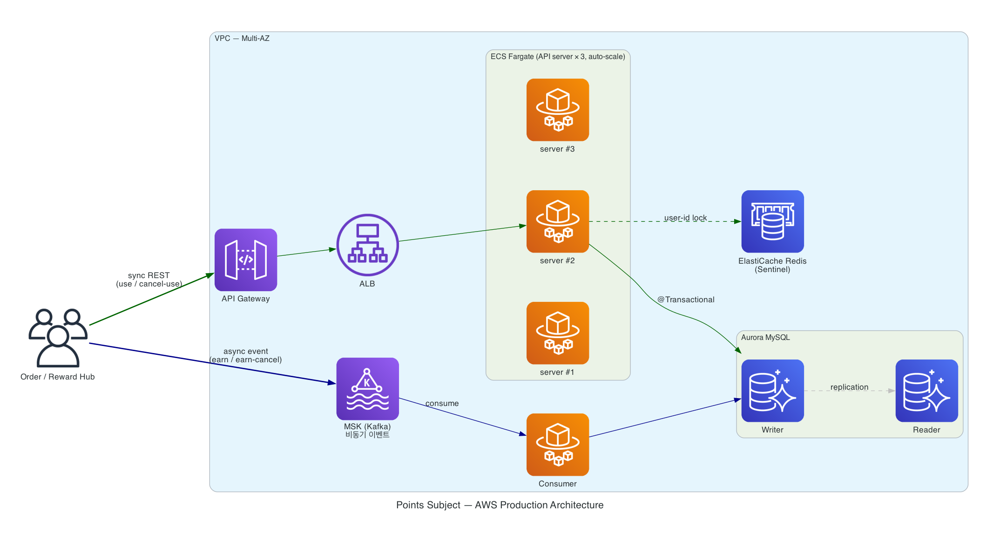

# AWS Architecture

points-subject 를 AWS 위에서 운영한다고 가정했을 때의 아키텍쳐. 특정 AWS 서비스 브랜드명 대신 일반적인 컴포넌트 이름으로 표기합니다.

---

## 다이어그램



---

## 흐름

### 1. 사용 / 사용취소 — sync (녹색 화살표)

```
Order/Reward Hub  ─►  API Gateway  ─►  Load Balancer  ─►  Application Server (× 3, 가용영역 분산)
                                                                  │
                                                                  ├─►  Redis  (user-id lock)
                                                                  └─►  MySQL Writer  (@Transactional)
```

- **결제 critical path** — Order 가 즉시 응답을 받아야 함 (포인트 차감 실패 시 결제도 막아야 회계 미스 방지)
- **정확성 우선**: 매 요청 비관 락(`SELECT FOR UPDATE`) + DB `SUM(remaining_amount)` 으로 정합성 보장 — 결제 트랜잭션은 Redis 캐시를 거치지 않고 항상 DB 에서 직접 확인

### 2. 적립 / 적립취소 — async (파랑 화살표)

```
Order/Reward Hub  ─►  Kafka  ─►  Consumer Server  ─►  MySQL Writer
```

- **spike 흡수 우선** — 프로모션 시점의 폭증을 Kafka 가 버퍼링, Consumer 는 자기 페이스로 처리
- 적립 이벤트엔 자연 키 (`external_event_id`) 멱등 차단 필수 → at-least-once 의 중복 도착에서도 안전

---

## 컴포넌트별 의도

| 컴포넌트 | 운영 의도 |
| --- | --- |
| **API Gateway** | 진입점 — throttling / 인증 / 외부 노출 |
| **Load Balancer** | 가용영역 로드 밸런싱 — Application Server 들에 분산 |
| **Application Server (× 3)** | 사용/사용취소 sync REST 처리, auto-scaling 으로 트래픽 흡수 |
| **Consumer Server** | 적립/적립취소 async event 소비 |
| **Kafka** | 비동기 이벤트 메시징 — Order/Reward publish, Consumer subscribe |
| **MySQL (Writer + Reader)** | 영속성 — Writer 는 모든 트랜잭션 전담. Reader 는 무거운 read 쿼리 분산용 (read 부하가 작으면 Writer 단독으로도 충분) |
| **Redis** | **분산락 + 잔액 캐시** (dual-purpose) — 아래 §핵심 결정 4 참조 |

---

## 핵심 결정

| # | 영역 | 결정 | 사유 |
| --- | --- | --- | --- |
| 1 | sync vs async 분리 | 사용/사용취소 = sync REST, 적립/적립취소 = async event | 결제 즉시성 vs spike 흡수 trade-off |
| 2 | Compute | 컨테이너 기반 Application Server (Kubernetes/serverless 아님) | 단일 서비스 운영 부담 최소, JPA 친화 |
| 3 | DB | MySQL Writer + Reader | H2 MySQL mode 와 dialect 호환, replica 비용 효율, 특정 시점 복구/자동 백업/failover < 30s |
| 4 | **Redis 역할** | 분산락 + 잔액 캐시 (dual-purpose) | 락만이면 Redis 클러스터 비용 정당화 약함. 잔액은 **결제 트랜잭션 우회 / UI 미리보기에만 캐시** (정확성=DB, 미리보기=Redis 분리 패턴) |
| 5 | Messaging | Kafka | high throughput + 메시지 보존 (replay 가능) + consumer group 모델로 운영|

---

## 본 저장소 코드와의 차이

본 다이어그램은 **운영 환경 청사진** 이고, 본 저장소 코드는 **단일 인스턴스 학습용** 입니다.

| 영역 | 운영 청사진 | 본 저장소 |
| --- | --- | --- |
| API 분리 | 사용/사용취소 sync REST + 적립/적립취소 async event | 모든 4 행위가 sync REST |
| Compute | Application Server × 3 (auto-scale) + Consumer Server | JVM 단일 인스턴스 |
| DB | MySQL Writer + Reader | H2 in-memory |
| Cache / Lock | Redis (분산락 + 잔액 캐시) | 미구현 — 현재 트래픽 규모에선 비관 락(`SELECT FOR UPDATE`) 만으로 정합성 충분. 인스턴스 / 트래픽이 커져 DB 락 경쟁이 부담될 시점에 도입 |
| Messaging | Kafka | 미구현 |
